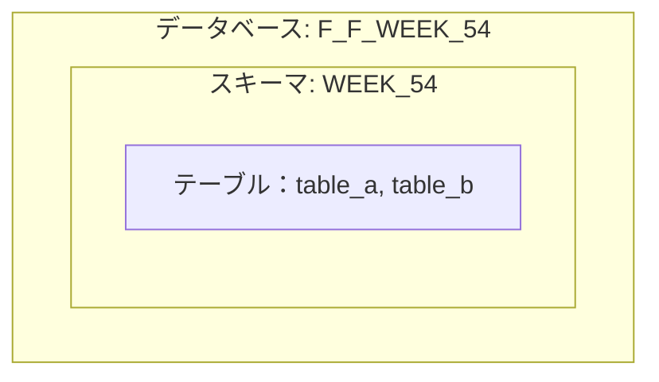
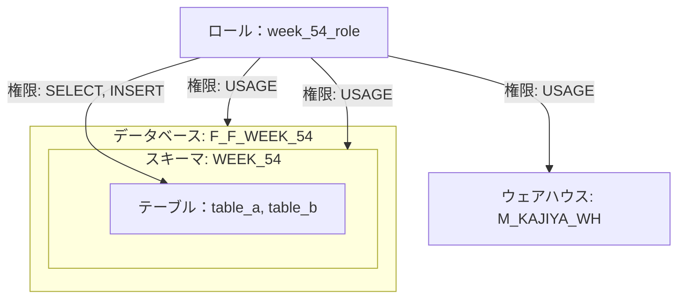

# Week-54

URL: https://frostyfriday.org/blog/2023/07/14/week-54-intermediate/

## 解説

Startup Code で、次のDB・スキーマ・テーブルが作成されます。

ロール week_54_role に次の権限が付与されます。

| オブジェクト種別 | オブジェクト名 | 権限 |
|---------------|-------------|-----|
| データベース    | F_F_WEEK_54 | USAGE | 
| スキーマ       | WEEK_54     | USAGE |
| テーブル       | WEEK_54内のすべて | SELECT |
| テーブル       | WEEK_54内のすべて | INSERT |

