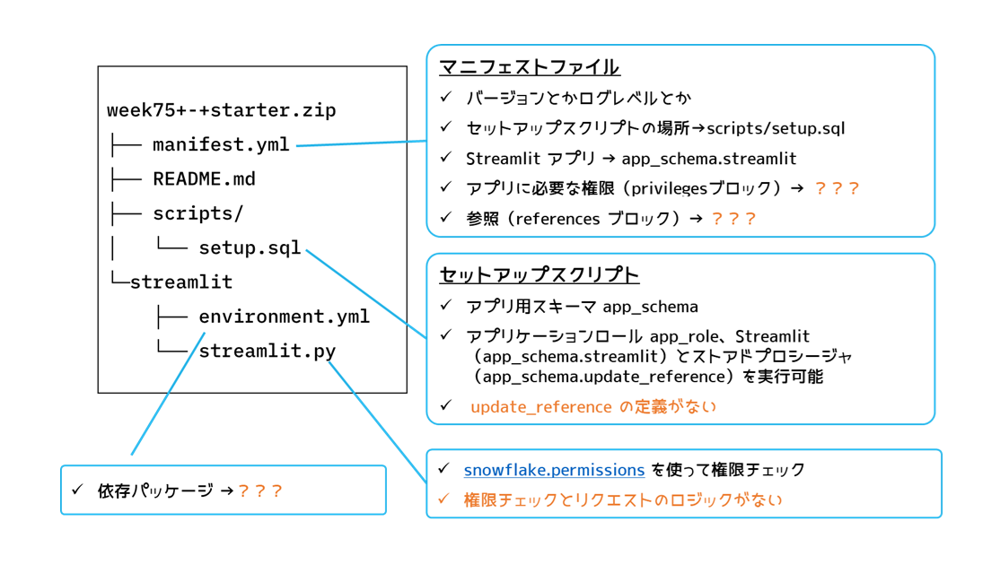
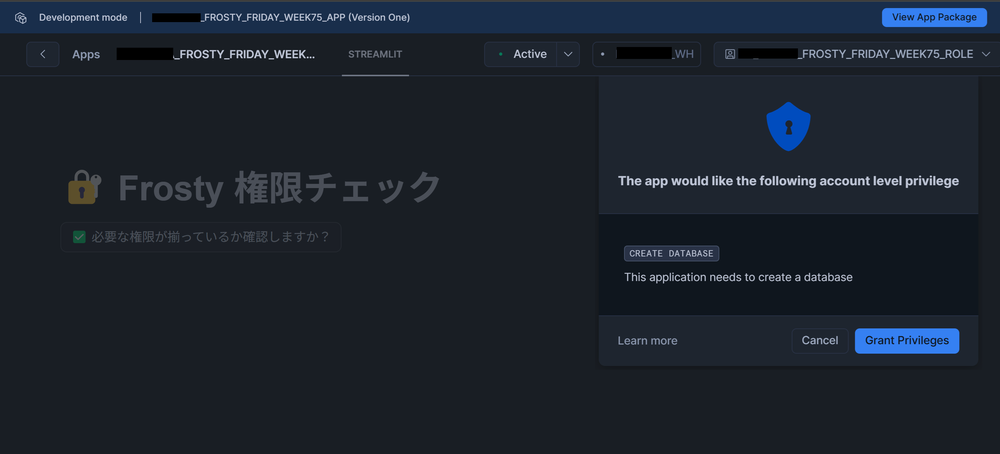

# [Week 75 – Hard, Native App Permissions](https://frostyfriday.org/blog/2023/12/15/week-75-hard/)
## チャレンジ内容（原文）

One of the cool things about native apps, is the ability to request permissions and be granted them without actually having real access to the consumer account.
Instead, the application gets the permissions.
But how do we request permissions? Well, let’s find out. Your challenge is to request:

- SELECT access to one table
- CREATE DATABASE on account

Your native app should then verify it has all the permissions it needs. The flow should look like:


Here is a zip with the skeleton code. You will need to change every file in the zip.
Good luck!

## チャレンジ内容（日本語訳・機械翻訳）

ネイティブアプリの優れた点の一つは、実際のユーザーアカウントへのアクセス権を持たずに権限を要求し、許可を得られることです。
代わりに、アプリケーションが権限を取得します。
では、権限をどのように要求するのでしょうか？ 早速見ていきましょう。あなたの課題は次の権限を要求することです：

- テーブルに対する SELECT
- アカウントでの CREATE DATABASE

その後、ネイティブアプリは必要な権限を全て取得していることを検証する必要があります。フローは以下のようになります：


以下にスケルトンコードのzipファイルを用意しました。zip内の全ファイルを変更する必要があります。
頑張ってください！

# 解法

「_You will need to change every file in the zip._」と言ったな。**あれは本当だ。**
本当に全ファイルに渡って、修正が必要なんです。。。

まず、スケルトンコードの中身はこんな感じなんですね。

```
week75+-+starter.zip
├── manifest.yml         # マニフェストファイル
├── README.md
├── scripts/
│   └── setup.sql        # セットアップスクリプト
└── streamlit/
    ├── streamlit.py     # Stremlit アプリ
    └── environment.yml  # Stremlit アプリの依存パッケージ
```

修正箇所はオレンジの個所です。



以下、解法の詳細は [こちらの記事](https://zenn.dev/datum_studio/articles/week75-native-app-permissions) に記載しました。

# フォルダ説明

| フォルダ名 | 説明 |
| :-: | :-: |
|week75starter|オリジナルの Native App ソースコード|
|app|修正した Native App ソースコード|

# 開発環境の使い方

## 起動
make コマンドで開発環境コンテナを起動します。

```
❯ make run
```

以降の操作はコンテナ内で行います。

## 環境設定

使用する環境用の接続情報を `~/.snowflake/config.toml` に記載します。

```toml
[connections.week75]
account = "week75-account"
user = "your_user"
database = "your_database"
schema = "your_schema"
warehouse = "your_warehouse"
role = "your_role"
authenticator = "SNOWFLAKE_JWT"
```

また、アプリケーションのプロジェクト定義を `snowflake.toml` に記載します。（`snow app` でデプロイするために必要）  

```yml
definition_version: 2
entities:
  pkg:
    type: application package
    identifier: frosty_friday_week75_pkg
    artifacts:
      - src: app/*
        dest: ./
    manifest: app/manifest.yml
  app:
    type: application
    identifier: frosty_friday_week75_app
    from:
      target: pkg

```

## Application Packageの作成とアップロード

```
# Application Packageの作成とアップロード
$ snow app deploy
```

```log
$ snow app deploy
Creating new application package frosty_friday_week75_pkg in account.
Checking if stage frosty_friday_week75_pkg.app_src.stage exists, or creating a new one if none exists.
Performing a diff between the Snowflake stage: stage and your local deploy_root: /workspace/output/deploy.
Local changes to be deployed:
  added:    app/README.md -> README.md
  added:    app/manifest.yml -> manifest.yml
  added:    app/scripts/setup.sql -> scripts/setup.sql
  added:    app/streamlit/environment.yml -> streamlit/environment.yml
  added:    app/streamlit/streamlit.py -> streamlit/streamlit.py
Uploading files from local /workspace/output/deploy directory to stage.
Validating Snowflake Native App setup script.
Deployed successfully. Application package and stage are up-to-date.
```

これで、プロジェクト定義で pkg に指定した内容でパッケージ置き場が作成される。ステージにアプリケーションのソースファイルがアップロードされる。

```
# Applicationのインストール
$ snow app run
```

```log
root@033a11c7debb:/workspace# snow app run
Checking if stage frosty_friday_week75_pkg.app_src.stage exists, or creating a new one if none exists.
Performing a diff between the Snowflake stage: stage and your local deploy_root: /workspace/output/deploy.
Local changes to be deployed:
  modified: app/scripts/setup.sql -> scripts/setup.sql
Uploading files from local /workspace/output/deploy directory to stage.
Validating Snowflake Native App setup script.
Creating new application object m_kajiya_frosty_friday_week75_app in account.
Application 'FROSTY_FRIDAY_WEEK75_APP' created successfully.

Your application object (m_kajiya_frosty_friday_week75_app) is now available:
https://app.snowflake.com/<your_account>/sandbox/#/apps/application/FROSTY_FRIDAY_WEEK75_APP
```

これで、プロジェクト定義で app に指定した内容でアプリケーションが作成される。URLにアクセスしよう。



